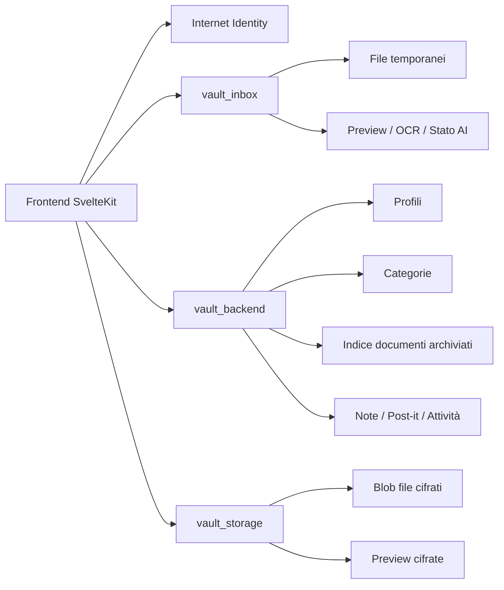

# Backend ICP e Modello Dati

## Obiettivo

Trasformare Fattura Vault da app locale/browser in una dapp ICP vera, mantenendo la UX già costruita:

- login con Internet Identity
- documenti salvati per utente
- categorie, note, post-it e stato sicurezza persistenti
- file cifrati prima del salvataggio
- niente recupero amministrativo dei documenti da parte nostra

## Decisioni chiave

### 1. Backend in Rust

Il backend applicativo sarà scritto in Rust.

Motivi:

- più controllo su stable memory
- più adatto a gestire strutture dati persistenti e chunking file
- migliore base per cifratura, blob storage e crescita futura

### 2. Tre canister backend, non uno solo

La struttura iniziale consigliata è questa:

1. `vault_inbox`
- file temporanei di inbox
- preview temporanee
- stato AI / OCR
- dati estratti prima dell'archiviazione
- lifecycle temporaneo cross-device

2. `vault_backend`
- profilo utente
- stato sicurezza
- categorie
- indice documenti
- note
- post-it
- attività recenti

3. `vault_storage`
- blob cifrati dei file
- preview cifrate
- upload chunked

Il frontend resta nel canister asset già esistente.

Questa separazione evita di mescolare:

- dati piccoli e strutturati
- file binari grandi

ed evita di dover riscrivere tutto appena il vault comincia a riempirsi.

## Architettura



## Modello di cifratura

### Regola generale

I file non vanno salvati in chiaro nel canister.

Il modello consigliato è:

- cifratura lato client nel browser
- il canister salva solo blob cifrati
- il frontend recupera e decifra i dati solo dopo autenticazione Internet Identity

### Chiavi consigliate

Per non complicare inutilmente la v1, il modello più equilibrato è questo:

1. `metadata key` per utente
- derivata dal contesto utente
- usata per cifrare:
  - titolo documento
  - nome file
  - merchant/esercente
  - tag
  - note
  - dati fattura
  - dati garanzia
  - contenuto note
  - contenuto post-it

2. `file key` per documento
- derivata per singolo `document_id`
- usata per cifrare:
  - file originale
  - preview / thumbnail

### Perché così

Con una sola chiave utente per tutti i file:

- le liste si decifrano facilmente
- il frontend fa meno lavoro

Con una chiave per file:

- i blob grandi restano isolati
- possiamo scaricare/aprire un file senza dover trattare l’intero vault come un unico blocco

### Collegamento con Internet Identity

Il principio di prodotto resta questo:

- perdi accesso a Internet Identity
- senza recovery phrase o dispositivi di backup
- perdi anche la possibilità di decifrare i file

Noi non conserviamo una chiave di recupero amministrativa.

## Cosa resta in chiaro e cosa no

### In chiaro nel backend

Per far funzionare bene l’app, alcuni campi indice conviene tenerli non cifrati:

- `document_id`
- `owner_principal`
- `status` (`inbox` / `processed`)
- `category_id`
- `payment_status`
- `mime_type`
- `size_bytes`
- `created_at`
- `updated_at`
- `document_date` opzionale
- `has_expiry`
- `expiry_date` opzionale
- riferimenti blob (`blob_id`, `preview_blob_id`)

Questi campi servono per:

- lista documenti
- filtri base
- ordinamento
- contatori dashboard

### Cifrato nel backend

I contenuti più sensibili devono stare nel payload cifrato:

- `title`
- `original_file_name`
- `merchant_name`
- `amount`
- `tags`
- `notes`
- `invoice_data`
- `warranty_data`
- testo delle note
- testo dei post-it

## Modello dati applicativo

### Profilo utente

```rust
pub struct UserProfile {
    pub owner: Principal,
    pub display_name: Option<String>,
    pub created_at_ns: u64,
    pub updated_at_ns: u64,
    pub security: SecurityState,
}

pub struct SecurityState {
    pub ack_recovery_phrase: bool,
    pub ack_backup_device: bool,
    pub ack_risk_understood: bool,
    pub completed_at_ns: Option<u64>,
    pub last_reviewed_at_ns: Option<u64>,
}
```

### Categorie

Le categorie non vanno più referenziate per nome ma per `category_id`.

Questo evita problemi quando l’utente rinomina una categoria custom.

```rust
pub struct CategoryRecord {
    pub id: String,                 // es. "invoice" o "cat_..."
    pub owner: Principal,           // per default può essere anche il principal del creator
    pub is_default: bool,
    pub name: String,
    pub color: String,
    pub icon: String,
    pub sort_order: u32,
    pub created_at_ns: u64,
    pub updated_at_ns: u64,
}
```

Per i default consiglio ID fissi:

- `invoice`
- `warranty`
- `receipt`
- `contract`
- `identity`
- `health`
- `home`
- `car`
- `education`
- `work`
- `finance`
- `insurance`
- `subscription`
- `tax`
- `other`

### Documento

```rust
pub enum DocumentStatus {
    Inbox,
    Processed,
}

pub enum PaymentStatus {
    Due,
    Paid,
}

pub struct DocumentRecord {
    pub id: String,
    pub owner: Principal,
    pub category_id: String,
    pub status: DocumentStatus,
    pub payment_status: PaymentStatus,
    pub mime_type: String,
    pub size_bytes: u64,
    pub created_at_ns: u64,
    pub updated_at_ns: u64,
    pub document_date_ns: Option<u64>,
    pub has_expiry: bool,
    pub expiry_date_ns: Option<u64>,
    pub expiry_type: Option<String>,
    pub expiry_duration: Option<String>,
    pub blob_id: String,
    pub preview_blob_id: Option<String>,
    pub encrypted_metadata: Vec<u8>,
}
```

### Metadata documento cifrati

Questo payload viene creato lato client e salvato già cifrato.

```rust
pub struct DocumentMetadataPlaintext {
    pub title: String,
    pub original_file_name: String,
    pub merchant_name: Option<String>,
    pub amount: Option<f64>,
    pub tags: Vec<String>,
    pub notes: Option<String>,
    pub invoice_data: Option<InvoiceData>,
    pub warranty_data: Option<WarrantyData>,
}
```

### Note

```rust
pub struct NoteRecord {
    pub id: String,
    pub owner: Principal,
    pub title: String,
    pub encrypted_content: Vec<u8>,
    pub pinned: bool,
    pub created_at_ns: u64,
    pub updated_at_ns: u64,
}
```

### Post-it

```rust
pub struct PostItRecord {
    pub id: String,
    pub owner: Principal,
    pub encrypted_text: Vec<u8>,
    pub completed: bool,
    pub color: String,
    pub created_at_ns: u64,
    pub updated_at_ns: u64,
}
```

### Attività recenti

```rust
pub enum ActivityType {
    Uploaded,
    Processed,
    Updated,
    Deleted,
}

pub struct ActivityRecord {
    pub id: String,
    pub owner: Principal,
    pub document_id: String,
    pub activity_type: ActivityType,
    pub category_id: Option<String>,
    pub at_ns: u64,
}
```

## Storage blob

Nel canister `vault_storage` i file vanno salvati a chunk, non in un singolo `Vec<u8>` enorme.

### Blob manifest

```rust
pub enum BlobKind {
    Original,
    Preview,
}

pub struct BlobManifest {
    pub blob_id: String,
    pub owner: Principal,
    pub document_id: String,
    pub kind: BlobKind,
    pub mime_type: String,
    pub total_size: u64,
    pub chunk_count: u32,
    pub sha256_hex: String,
    pub created_at_ns: u64,
    pub finalized: bool,
}
```

### Chunk

Chiave logica:

- `(blob_id, chunk_index)`

Valore:

- `Vec<u8>` del chunk cifrato

Dimensione consigliata chunk:

- `512 KB` o `1 MB`

così restiamo larghi rispetto ai limiti di payload.

## API consigliate

### `vault_backend`

#### Profilo

- `get_my_profile() -> opt UserProfile`
- `upsert_my_profile(display_name, security_state) -> UserProfile`

#### Categorie

- `get_my_categories() -> vec CategoryRecord`
- `add_custom_category(name, color, icon) -> Result<CategoryRecord, String>`
- `update_category(category_id, name, color, icon) -> Result<CategoryRecord, String>`
- `delete_custom_category(category_id) -> Result<(), String>`

#### Documenti

- `list_my_documents() -> vec DocumentRecord`
- `get_my_document(document_id) -> opt DocumentRecord`
- `create_document(record: DocumentRecord) -> Result<(), String>`
- `update_document(record: DocumentRecord) -> Result<(), String>`
- `delete_document(document_id) -> Result<(), String>`
- `bulk_update_documents(ids, patch) -> Result<(), String>`
- `bulk_delete_documents(ids) -> Result<(), String>`

#### Note

- `list_my_notes() -> vec NoteRecord`
- `upsert_note(note) -> Result<(), String>`
- `delete_note(note_id) -> Result<(), String>`

#### Post-it

- `list_my_postits() -> vec PostItRecord`
- `upsert_postit(postit) -> Result<(), String>`
- `delete_postit(postit_id) -> Result<(), String>`

#### Attività

- `list_my_activities(limit, cursor) -> vec ActivityRecord`

### `vault_storage`

- `create_blob(document_id, kind, mime_type, total_size, chunk_count, sha256_hex) -> BlobManifest`
- `upload_blob_chunk(blob_id, chunk_index, bytes) -> Result<(), String>`
- `finalize_blob(blob_id) -> Result<(), String>`
- `get_blob_manifest(blob_id) -> opt BlobManifest`
- `get_blob_chunk(blob_id, chunk_index) -> opt vec nat8`
- `delete_blob(blob_id) -> Result<(), String>`

## Interfaccia Candid proposta per `vault_storage`

Anche se il canister storage verrà implementato nel secondo blocco, conviene fissare già ora i tipi e le firme pubbliche.

Questo ci dà tre vantaggi:

- frontend e backend applicativo possono già allinearsi sugli stessi payload
- eventuali binding TypeScript o Rust si possono generare presto
- il secondo blocco diventa implementazione, non riprogettazione

### Tipi Candid

```candid
type BlobKind = variant {
  Original;
  Preview;
};

type BlobManifest = record {
  blob_id : text;
  owner : principal;
  document_id : text;
  kind : BlobKind;
  mime_type : text;
  total_size : nat64;
  chunk_count : nat32;
  sha256_hex : text;
  created_at_ns : nat64;
  finalized : bool;
};

type BlobCreateInput = record {
  document_id : text;
  kind : BlobKind;
  mime_type : text;
  total_size : nat64;
  chunk_count : nat32;
  sha256_hex : text;
};

type BlobChunkInput = record {
  blob_id : text;
  chunk_index : nat32;
  bytes : blob;
};

type StorageError = variant {
  NotFound;
  Unauthorized;
  AlreadyExists;
  InvalidChunkIndex;
  InvalidState;
  InvalidChecksum;
  TooLarge;
  Message : text;
};

type StorageResult = variant {
  ok;
  err : StorageError;
};

type BlobManifestResult = variant {
  ok : BlobManifest;
  err : StorageError;
};

type BlobChunkResult = variant {
  ok : blob;
  err : StorageError;
};
```

### Service interface

```candid
service : {
  create_blob : (BlobCreateInput) -> (BlobManifestResult);
  upload_blob_chunk : (BlobChunkInput) -> (StorageResult);
  finalize_blob : (text) -> (StorageResult);
  get_blob_manifest : (text) -> (opt BlobManifest) query;
  get_blob_chunk : (text, nat32) -> (BlobChunkResult) query;
  delete_blob : (text) -> (StorageResult);
}
```

### Regole operative

- `create_blob` crea il manifest ma non rende il blob disponibile finché `finalize_blob` non va a buon fine
- `upload_blob_chunk` accetta solo chunk nell’intervallo `0..chunk_count-1`
- `get_blob_chunk` deve funzionare solo su blob `finalized = true`
- `delete_blob` elimina manifest e chunk
- `owner` non viene passato dal frontend: viene sempre derivato dal `caller`

### Nota su query e download

Per la v1 va bene tenere:

- `get_blob_manifest` come `query`
- `get_blob_chunk` come `query`

Perché il download non modifica stato.

Se in futuro introdurremo certificazione più forte o streaming diverso, potremo mantenere la stessa interfaccia logica e cambiare l’implementazione sotto.

## Stable memory

`vault_backend` deve usare `ic-stable-structures` da subito.

Strutture consigliate:

- `StableBTreeMap<PrincipalKey, UserProfile>`
- `StableBTreeMap<(PrincipalKey, CategoryId), CategoryRecord>`
- `StableBTreeMap<(PrincipalKey, DocumentId), DocumentRecord>`
- `StableBTreeMap<(PrincipalKey, NoteId), NoteRecord>`
- `StableBTreeMap<(PrincipalKey, PostItId), PostItRecord>`
- `StableBTreeMap<(PrincipalKey, ActivityId), ActivityRecord>`

`vault_storage`:

- `StableBTreeMap<(PrincipalKey, BlobId), BlobManifest>`
- `StableBTreeMap<(BlobId, ChunkIndex), Vec<u8>>`

Niente serializzazione massiva in `pre_upgrade`.

## Flussi principali

### Upload documento

1. login con Internet Identity
2. frontend genera `document_id`
3. frontend ottiene o deriva le chiavi di cifratura
4. cifra:
- file originale
- preview
- metadata documento
5. upload chunked al `vault_storage`
6. commit `DocumentRecord` nel `vault_backend`
7. aggiunta attività `Uploaded`

### Apertura documento

1. frontend legge `DocumentRecord`
2. ottiene il `blob_id`
3. scarica i chunk cifrati
4. recupera la chiave lato client
5. decifra file e metadata

### Elimina documento

1. elimina `DocumentRecord`
2. elimina `blob_id`
3. elimina `preview_blob_id`
4. crea attività `Deleted`

## Migrazione dal frontend locale attuale

La migrazione migliore non è automatica “silenziosa”.

Meglio una fase esplicita:

- `Importa dati locali nel vault ICP`

Così possiamo prendere da `localStorage`:

- profilo
- checklist sicurezza
- categorie custom
- note
- post-it
- documenti già presenti

e salvarli on-chain in modo controllato.

## Ordine di implementazione consigliato

### Fase 1

- scaffolding progetto ICP
- canister `vault_backend`
- tipi condivisi
- profilo utente
- stato sicurezza
- categorie
- note
- post-it

### Fase 2

- canister `vault_storage`
- upload chunked
- salvataggio documenti
- delete e download

### Fase 3

- cifratura client-side reale
- metadata cifrati
- file cifrati
- preview cifrate

### Fase 4

- migrazione dati locali -> ICP
- dashboard, inbox, categorie e vault letti dal backend

## Cosa non fare adesso

Per la prima versione backend non conviene introdurre subito:

- LLM nel canister
- ricerca full-text on-chain
- OCR on-chain
- analytics separate
- sharding multi-storage complesso

La priorità vera è:

- salvare bene
- salvare in modo stabile
- salvare per utente
- salvare cifrato

## Decisione consigliata

Decisione finale proposta:

- backend applicativo Rust
- due canister backend: `vault_backend` + `vault_storage`
- `stable memory` da subito
- file cifrati lato client
- metadata sensibili cifrati
- indici minimi in chiaro per far funzionare l’app
- nessun recupero amministrativo dei file
